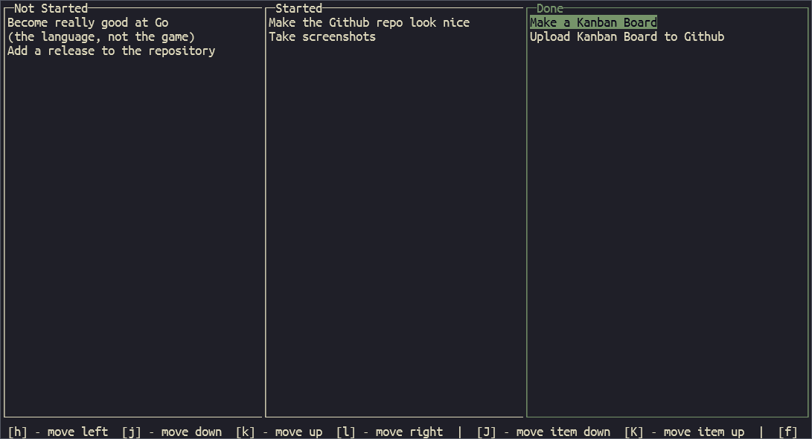

# A Simple Go Kanban Board

A simple little Kanban Board, built in Go using [Gocui](https://github.com/jroimartin/gocui)

## Useage

This tool looks for a `kanban.json` file in the current directory. If one is located, it will open the board, otherwise it will open a blank board. The user can then fill out the Kanban board as they wish. The Kanban board will save when the user exits, creating a new `kanban.json` file if one has not been found.

### Keybinds ⌨ 
- Moving the Cursor
    - `h`, `←` : move cursor left
    - `j`, `↓` : move cursor down
    - `k`, `↑` : move cursor up
    - `l`, `→` : move cursor right

- Moving Kanban Items
    - `H`, `g` : move Kanban item back
    - `J` : move Kanban item down
    - `K` : move Kanban item up
    - `L`, `f` : move Kanban item forward

- Managing Kanban Items
    - `n` : create new Kanban item 
    - `d` : delete selected Kanban item

- Popups
    - `y` : yes/accept 
    - `n` : no/decline 
    - `q` : quit (same as no/decline)

- The "New Kanban Item" popup has different keybinds
    - `C-q` : quit "New Kanban Item" popup
    - `Enter` : confirm Kanban Item name

- Misc
    - `q` : quit program, only on the main screen
    - `~` : toggle command log
    - `c` : clear command log (only when command log is open)

## Future Progress

The `kanban.json` file in this repository is used partially as an example as to the format of the file, but also to track the future of the project. Here are a few of the highlights:

- Rename Kanban items
- Save on exit confirmation, in case you don't want to save your changes (this can be mocked at the moment with `C-c`)
- General visual bug fixes 

### Credits

I could not have built this without the Gocui examples. Thanks to that team for providing them!
